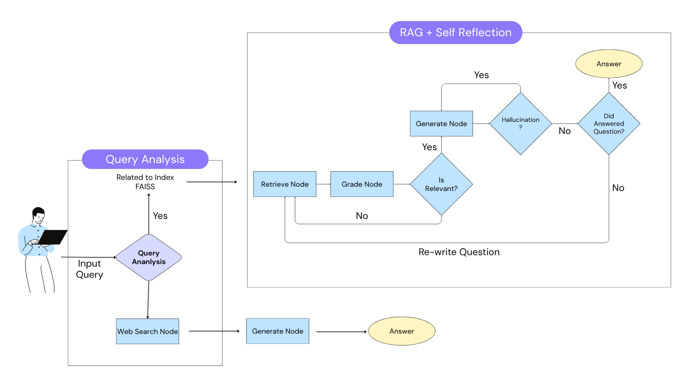

# Resume Bot 2.0

**Resume Bot 2.0** is an intelligent, resume-aware assistant built using an **adaptive Retrieval-Augmented Generation (RAG)** architecture. This is a updated version of my previos repo (https://github.com/NehaSJ99/resume-chatbot) of traditional RAG. It answers user questions about a candidate’s professional background (such as work experience, projects, and achievements) by dynamically retrieving relevant information from a PDF resume and validating generated responses.

## Overview

This project extends the traditional RAG pipeline by incorporating **LangGraph**, enabling conditional branching and iterative refinement of answers. When a user asks a question, the system routes it to a vectorstore or a web search tool, evaluates the relevance of retrieved content, checks if the answer is grounded in facts, and rewrites the query if necessary—until a trustworthy response is produced.

## Key Features

- **Adaptive RAG Pipeline**
  - Routes queries between vectorstore and web search based on intent.
  - Grades retrieved documents for relevance and filters irrelevant content.
  - Evaluates generated answers for hallucinations and completeness.
  - Rewrites questions and retries if the response is unsupported or incomplete.

- **LangGraph-Driven State Management**
  - Each stage (retrieval, grading, rewriting, generation) is modeled as a node.
  - Conditional transitions handle success/failure loops for robust control flow.

- **Resume-Driven Retrieval**
  - Parses resume PDFs using LangChain's `PyPDFLoader`.
  - Splits content into semantic chunks and embeds using OpenAI Embeddings.
  - Stores chunks in a FAISS vectorstore for fast vector-based retrieval.

- **Chat-Style Streamlit Interface**
  - Users interact through a persistent Q&A interface.
  - Responses are dynamically generated based on the latest resume content.
  - Previous context is retained in a session for continuity.

## Architecture



## Tech Stack

- **LLM & Embeddings:** OpenAI GPT-4o, OpenAI Embeddings
- **Orchestration:** LangGraph, LangChain
- **Vector Store:** FAISS
- **Parsing & Chunking:** PyPDFLoader, RecursiveCharacterTextSplitter
- **Frontend:** Streamlit

## Installation

```bash
git clone https://github.com/your-username/resume_bot_2.0.git
cd resume_bot_2.0

conda create -p venev python==3.10 -y
conda activate venv

pip install -r requirements.txt
```

## Running the App

```bash
streamlit run src/rag_pipeline/app.py
```

## Use Cases

- Personal portfolio websites with AI-driven interactivity.
- Intelligent resume exploration for recruiters or hiring managers.
- RAG design patterns and educational showcases for AI system architecture.

## Future Enhancements

- Add source attributions with highlighted snippets.
- Enable support for multiple user profiles/resumes.
- Track usage metrics and chat logs for evaluation.
- Dockerize and deploy to a public Streamlit or HuggingFace Space.
